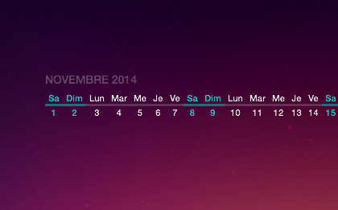
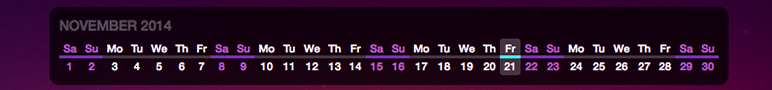
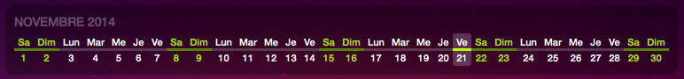

## Horizontal calendar widget

A simple [Übersicht](http://tracesof.net/uebersicht/) Widget. This will enable a sleek Dateline-like horizontal calendar on your desktop to make it more useful.



This version add __localization__ (French/English), easy positioning, and __custom appearence__ capabilities.<br>
__Fork from :__ [https://github.com/ashikahmad/horizontal-calendar-widget](https://github.com/ashikahmad/horizontal-calendar-widget)




## Position
- Top Left:  ```TL|left_margin|top_margin```
- Top Right: ```TR|right_margin|top_margin```
- Bottom Left: ```BL|left_margin|bottom_margin```
- Bottom Right: ```BR|right_margin|bottom_margin```
- Center on screen: ```C|0|0```
- Center vertically: ```C|left_margin|0```
- Center horizontally: ```C|0|top_margin```